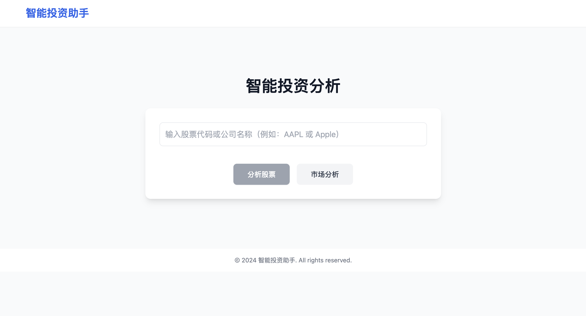

# AI 股票投资小助手

一个基于大模型的股票投资助手，目前只支持美股，具有股票分析和投资建议等功能。

目前是初步开发阶段

## Demo




## 功能特点

- 文档生成：支持多种类型的文档自动生成
- 数据分析：提供数据可视化和分析能力
- 股票分析：实时股票数据分析和可视化
- 投资建议：基于市场数据的智能投资建议

## 本地安装和运行

### 环境要求

- Python 3.8+
- Node.js 16+
- npm 8+

### 后端设置

1. 创建并激活Python虚拟环境：
```bash
# 创建虚拟环境
python -m venv venv

# 激活虚拟环境
# 在macOS/Linux上：
source venv/bin/activate
# 在Windows上：
.\venv\Scripts\activate
```

2. 安装Python依赖和本地包：
```bash
# 安装依赖
pip install -r requirements.txt

# 安装本地包（开发模式）
pip install -e .
```

3. 配置环境变量：
在项目根目录创建 `.env` 文件，添加必要的环境变量：
```
OPENAI_API_KEY=your_openai_api_key
OPENAI_MODEL=gpt-4
```

4. 启动后端服务：
```bash
cd api
uvicorn main:app --reload --host 0.0.0.0 --port 8000
```

### 前端设置

1. 安装Node.js依赖：
```bash
cd frontend
npm install
```

2. 启动前端开发服务器：
```bash
npm run dev
```

前端服务将在 http://localhost:5173 启动，后端API服务将在 http://localhost:8000 启动。

## 使用说明

1. 打开浏览器访问 http://localhost:5173
2. 从左侧工具栏拖拽所需的功能节点到工作区
3. 配置节点参数
4. 点击执行按钮运行工作流

### 可用节点类型

- 文档生成器：自动生成各类文档
- 数据分析器：分析和可视化数据
- 股票分析器：分析股票市场数据
- 投资顾问：提供投资建议和组合配置

## 注意事项

1. 确保所有依赖都已正确安装
2. 检查环境变量配置是否正确
3. 前端和后端服务需要在不同的终端窗口中运行
4. 如遇到问题，请检查控制台输出的错误信息

### API注册说明

为了获取完整的市场数据和新闻信息，您需要注册以下免费API：

1. Alpha Vantage API
   - 访问 https://www.alphavantage.co/support/#api-key 注册免费API key
   - 免费版每分钟限制5次请求
   - 用于获取市场新闻和股票数据

2. Finnhub API
   - 访问 https://finnhub.io/register 注册免费API key
   - 免费版每分钟限制30次请求
   - 用于获取实时市场新闻和股票数据

3. Yahoo Finance API
   - 无需注册，直接使用RSS feed
   - 完全免费，无使用限制
   - 用于获取基础市场新闻

获取API key后，将它们添加到环境变量中：
```bash
# 在 .env 文件中添加
ALPHA_VANTAGE_API_KEY=your_alpha_vantage_key
FINNHUB_API_KEY=your_finnhub_key
```

注意：如果不设置这些API key，系统将使用演示模式，但可能会受到更严格的访问限制。

## 常见问题

1. 如果遇到依赖安装问题，可以尝试：
```bash
# 更新pip
python -m pip install --upgrade pip

# 清除npm缓存
npm cache clean --force
```

2. 如果遇到模块导入错误，确保已经安装了本地包：
```bash
# 重新安装本地包
pip install -e .
```

3. 如果端口被占用，可以修改启动命令中的端口号：
```bash
# 后端使用其他端口
uvicorn main:app --reload --host 0.0.0.0 --port 8001

# 前端使用其他端口
# 修改 vite.config.ts 中的端口配置
```

## 贡献指南

欢迎提交Issue和Pull Request来帮助改进项目。

## 许可证

MIT License
